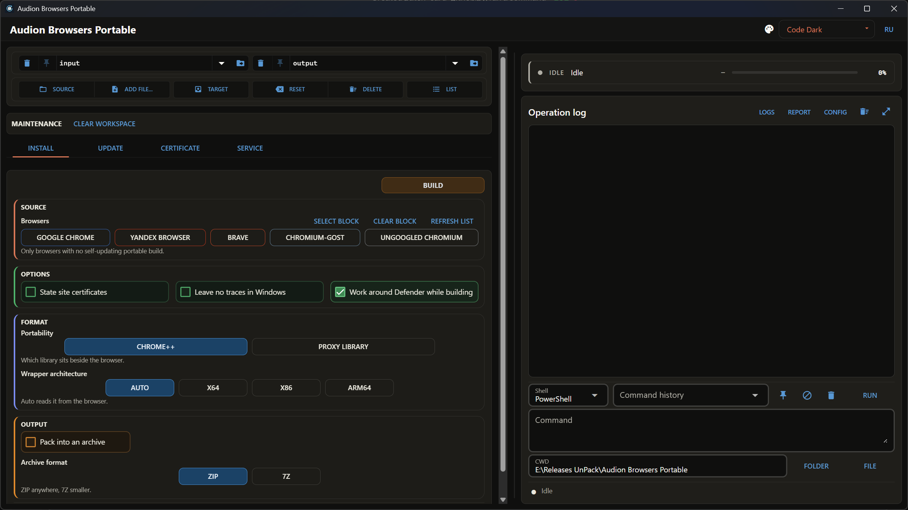

# Audion Browsers Portable

<!-- audion:release -->

  
  
  
  

**Version 1.0.1** · 2026-09-02 · 82.4 MB

- [Direct download](https://audion.dev/get/browsers-portable/1.0.1/Audion_Browsers_Portable_v1.0.1_Full.zip) — unmetered, no rate limits
- [Project page](https://audion.dev/downloads/browsers-portable) — every version and how to install

`SHA-256: 43ef6d7982fb4ac26eecf48cccd3ee340e79960a74476b7eb072baf57cd6c1f7`

---

An **Audion** tool, published by [Tensionix](https://github.com/Tensionix).
<!-- /audion:release -->

[Русский](README_RU.md) · [User Guide](USER_GUIDE_EN.md)

One engine for the whole Chromium stack: downloads, unpacks, assembles portable
browsers, and keeps them updated.

## Why It Exists

A portable browser is wanted for two reasons: it leaves the system alone and it
travels as a folder. But half the browsers have no portable build at all, and the
other half have one that never updates. Building it by hand is possible; updating
it by hand every three weeks is not.

**Nothing is installed into Windows.** The installer is not run but unpacked:
what it intended to place into the system is taken out of it instead. The profile
lives in the build folder, next to the browser.

## Who Is on the List, and Why

One rule decides: **the vendor has no portable build that updates itself**.

| browser | why it is here |
|---|---|
| Google Chrome | no portable build at all |
| Yandex Browser | no portable build, and the Russian state root certificates are already embedded |
| Brave | third-party builds exist, none of them update |
| Chromium-Gost | speaks the GOST TLS that state portals require; an archive exists, updates do not |
| Ungoogled Chromium | an archive exists, an updater does not — that is the point of the project |

**Who is absent, and not by oversight:**

* **Vivaldi** — an official standalone install with working auto-update;
* **Cent Browser** — an official portable build with a built-in updater;
* **Opera** — no separate portable file, but auto-update packages ship beside the
  installer, so it can update itself;
* **Thorium** — tried and dropped: the main repository publishes releases without
  files, the fork builds 32-bit only, and the extension store does not work
  there — an ordinary ad blocker cannot be installed.

The logic is simple: if a browser can update itself, wrapping it means taking on
work the vendor already does — and doing it worse.

## Next

* [User Guide](USER_GUIDE_EN.md) — step by step.
* [Checklist](SMOKE_TEST_RU.md) — what is run before a release (Russian).
* `tools\CHROME_PLUS_AND_DEFENDER.md` — Chrome++ and the antivirus false positive
  during builds (Russian).
* `tools\DECISIONS_EN.md` — decisions taken.

---

## Technical Reference

### What You Get

A build folder: the browser, the profile, a launcher, and a record of which
versions are inside. It travels whole and leaves no trace in the system.

### Updating

The engine compares what the vendor has released against what is in the build and
updates only what changed. The profile is left alone.

### The Antivirus False Alarm

A build can fail during packing with a file access error — this is neither the
disk nor a corrupt archive, but the antivirus inspecting a freshly written
executable. Covered in `tools\CHROME_PLUS_AND_DEFENDER.md`.
