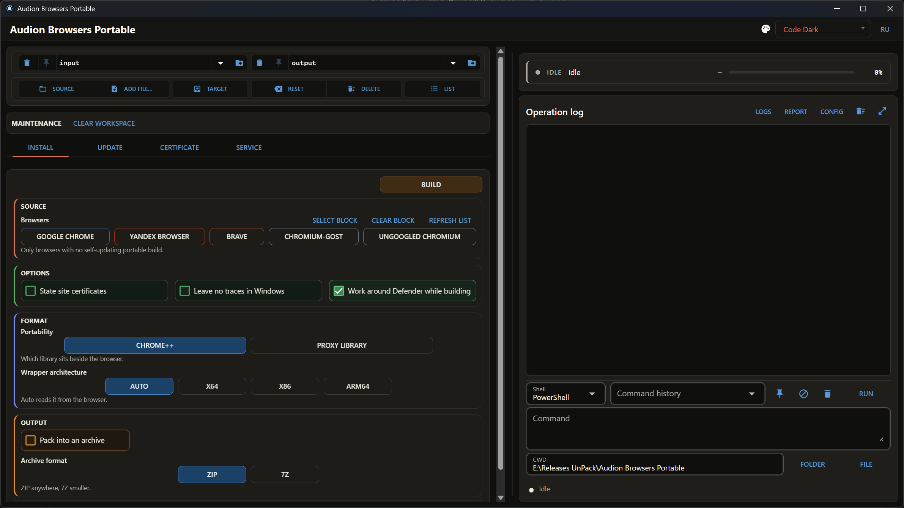

# Audion Browsers Portable

<!-- audion:release -->

  
  
  
  

**Version 1.4.0** · 2026-10-04 · 78.9 MB

- [Direct download](https://audion.dev/get/browsers-portable/1.4.0/Audion_Browsers_Portable_v1.4.0_Full.zip) — unmetered, no rate limits
- [Project page](https://audion.dev/downloads/browsers-portable) — every version and how to install

`SHA-256: c3f02da1c5e3689e53f80b5324fea39e6791228096c7ab806082073e0dfeab69`

---

An **Audion** tool, published by [Tensionix](https://github.com/Tensionix).
<!-- /audion:release -->

[English README](docs/README_EN.md) · [User Guide](docs/USER_GUIDE_EN.md) | [Русский README](docs/README_RU.md) · [Руководство](docs/USER_GUIDE_RU.md)

**Contents**

- [Portable libraries](#portable-libraries)
- [Single-browser tools consolidated](#single-browser-tools-consolidated)
- [Why It Exists](#why-it-exists)
- [Official Downloads](#official-downloads)
- [Who Is on the DLL Build List, and Why](#who-is-on-the-dll-build-list-and-why)
- [Next](#next)
- [Technical Reference](#technical-reference)
  - [What You Get](#what-you-get)
  - [Updating](#updating)
  - [The Antivirus False Alarm](#the-antivirus-false-alarm)

One engine for the whole Chromium stack: downloads, unpacks, assembles portable
browsers, and keeps them updated.

## Portable libraries

The default library is [Proxy library](https://gitflic.ru/project/neyrostalker/proksi-biblioteka) (x86/x64), with every optional switch in `App/version.ini` set to `0`. Alternatives are [Chrome++ (DeftKing)](https://github.com/DeftKing/chrome_plus) and [Vivaldi++](https://github.com/ca-x/vivaldi_plus), both supporting x86/x64/ARM64. A failed release lookup or download falls back to a verified archive of the selected library in the project. The generated launcher starts in `App` so relative `Data` and `Cache` paths stay inside the build. Registry cleanup applies only to Chrome++.

## Single-browser tools consolidated

`UPDATE` → `UPDATE DLL ONLY` refreshes the selected library in existing builds
without downloading the browser. Browser files, `Data` and `Cache` stay in place.
The same library keeps its INI; switching libraries creates the standard INI,
with all optional switches set to zero for Proxy library.

Build, check and update forms have optional Chrome/Yandex full-installer URLs
under `Advanced`. Blank fields use official sources. Custom installers are
downloaded afresh during build and update.

`Disable Yandex updater` is enabled by default and removes only
`service_update.exe` inside Yandex's `App`. Update the browser through this
program afterwards.

`CERTIFICATE` → `ADD TO BUILD` saves the two Russian Trusted CA certificates and
install/revoke commands in an existing build. Installing Windows trust remains
a separate command.

## Why It Exists

A portable browser is wanted for two reasons: it leaves the system alone and it
travels as a folder. But half the browsers have no portable build at all, and the
other half have one that never updates. Building it by hand is possible; updating
it by hand every three weeks is not.

**Nothing is installed into Windows.** The installer is not run but unpacked:
what it intended to place into the system is taken out of it instead. The profile
lives in the build folder, next to the browser.

## Official Downloads

The `Downloads` tab saves original files under `Browser Downloads` in the Target
folder: Cent Browser portable SFX (x86/x64), LibreWolf portable ZIP (x64/ARM64),
Vivaldi installer (x86/x64/ARM64), and the regular DuckDuckGo installer (x64).
For Vivaldi, manually choose Advanced → Install Standalone in the saved installer.
The program does not run or unpack these files or replace their DLLs.

Repeat downloads verify the saved SHA256; DuckDuckGo's unversioned installer is
downloaded to a temporary file and replaces the saved copy only when its hash changes. A source failure is reported for
that browser while the remaining downloads continue. Zen is omitted because its
current official Windows release has no portable package (checked 2026-10-01).

## Who Is on the DLL Build List, and Why

One rule decides for the DLL builder: **the vendor has no portable build that updates itself**.

| browser | why it is here |
|---|---|
| Google Chrome | no portable build at all |
| Yandex Browser | no portable build, and the Russian state root certificates are already embedded |
| Brave | third-party builds exist, none of them update |
| Chromium-Gost | speaks the GOST TLS that state portals require; an archive exists, updates do not |
| Ungoogled Chromium | an archive exists, an updater does not — that is the point of the project |

**Excluded from the DLL builder:**

* **Vivaldi** — an official standalone install with working auto-update;
* **Cent Browser** — an official portable build with a built-in updater;
* **Opera** — no separate portable file, but auto-update packages ship beside the
  installer, so it can update itself;
* **Thorium** — tried and dropped: the main repository publishes releases without
  files, the fork builds 32-bit only, and the extension store does not work
  there — an ordinary ad blocker cannot be installed.

The logic is simple: if a browser can update itself, wrapping it means taking on
work the vendor already does — and doing it worse.

## Next

* [User Guide](docs/USER_GUIDE_EN.md) — step by step.
* [Checklist](docs/SMOKE_TEST_RU.md) — what is run before a release (Russian).
* `tools\CHROME_PLUS_AND_DEFENDER.md` — Chrome++ and the antivirus false positive
  during builds (Russian).
* `tools\DECISIONS_EN.md` — decisions taken.

---

## Technical Reference

### What You Get

A build folder: the browser, the profile, a launcher, and a record of which
versions are inside. It travels as a folder. With zero INI switches, registry writes and optional restrictions remain under browser control.

### Updating

The engine compares what the vendor has released against what is in the build and
updates only what changed. The profile is left alone.

### The Antivirus False Alarm

A build can fail during packing with a file access error — this is neither the
disk nor a corrupt archive, but the antivirus inspecting a freshly written
executable. Covered in `tools\CHROME_PLUS_AND_DEFENDER.md`.
